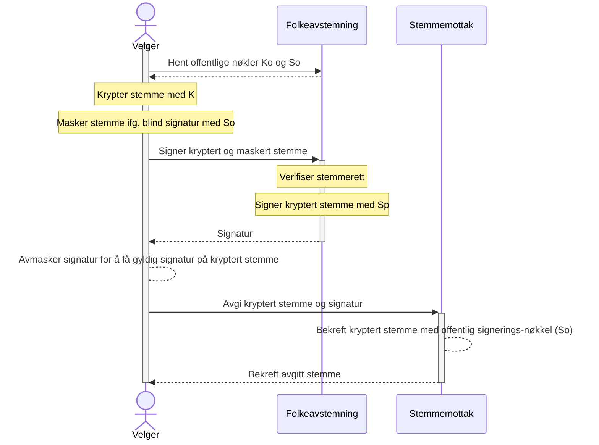

# Kryptografi

Flere kryptografiske alternativ for sikkerhet og hemmelighold av stemmer ble vurdert.

- Kryptering av stemmer, med link til velger
- 3.part
- Mixnets
- Homomorphic kryptering
- Blockchain
- Blind signering
- Kontrollkode

Løsningene ble vurdert på bakgrunn av følgende kriterier:
- Anonymitet: Er det mulig å koble velger og stemme i ettertid?
- Etterprøvbarhet: Kan man ettergå valget?
- Integritet: Kan valget endres?
- Kompleksitet: Hvor komplekst vil dette alternative være å implementere, både i tid og vanskelighetsgrad. Hvor stor risiko ved feil implementasjon.

### Kryptering av stemmer, med link til velger
Stemmer krypteres av public key og lagres med tilknytning til velger. Private Key låses ned slik at den ikke kan brukes før avstemningen er over. Knytning til velger fjernes før opptelling.   

- **Anonymitet**: Lav. Direkte link til velgeren kompromitterer anonymiteten.
- **Etterprøvbarhet**: Høy. Det er mulig å spore og verifisere stemmen tilbake til den enkelte velger. Det kan åpnes for at velger kan bekrefte at sin stemme ikke er endret.
- **Integritet**: Middels. Kryptering sikrer at stemmeinnholdet forblir uendret men ingen sikkerhetsmekanismer for å forhindre endring av stemmer.
- **Kompleksitet**: Lav. Enkelt å implementere.

#### Oppsummering
Løsningen med å kryptere stemmer og lagre de med tilknytning til velger vil være den enkleste og mest fleksible løsningen, men vil ikke kunne garantere hemmelighold fra myndighetenes side. Forkastes av denne grunn.

### 3.part
Manntall, og stemmerett håndteres av en egen instans, f.eks. Skattedepartementet. 3.part validerer stemmerett og gir en kvalifikasjons-token som Valgdirektoratet kan verifisere. Så lenge Skatt og Valgdirektoratet ikke samarbeider om å korrelere stemme og velger vil dette garantere anonymitet.

- **Anonymitet**: Høy. Tredjepart håndterer stemmeretten separat fra stemmeprosessen. Valgdirektoratet vil ikke kunne se persondata i sammenheng med stemme.
- **Etterprøvbarhet**: Middels. Avhenger av tredjepartens systemer og prosesser.
- **Integritet**: Høy. Tredjepartens involvering gjør manipulasjon vanskelig.
- **Kompleksitet**: Høy. Krever avtale med tredjepart. Avhenger av tredjepartens systemer og deres integrasjoner. Tidskrevende.

#### Oppsummering
På grunn av krav til 3.part og den ekstra tidsbruken dette påfører prosjektet vil dette ikke være mulig å gjennomføre innen rammene gitt av prosjektet.

### Mixnets
Mixnets brukes til å fjerne link mellom velger og stemme. Stemmer sendes gjennom en rekke noder som blander dem, slik at det blir umulig å spore en stemme tilbake til en individuell velger. Dette styrker anonymiteten og forhindrer sporing av stemmer.


- **Anonymitet**: Svært høy. Effektiv anonymisering av stemmer.
- **Etterprøvbarhet**: Lav. Anonymiseringen gjør det vanskelig å spore stemmer tilbake til individuelle velgere. Krever matematisk bevis på korrekt blanding av stemmer for å ha tillit til valget.
- **Integritet**: Høy.
- **Kompleksitet**: Høy. Krever avanserte systemer og algoritmer for å fungere effektivt. Mangel på 3.part vil begrense effektiviteten.

#### Oppsummering
For kompleks implementasjon og for liten tid til å implementere innenfor rammene til prosjektet.

### Homomorphic kryptering
Homomorphic kryptering tillater at man kan telle opp krypterte stemmer uten å dekryptere dem, noe som sikrer både konfidensialitet og integritet gjennom hele stemmeprosessen.

**Fordeler**
- **Anonymitet**: Høy. Stemmer forblir kryptert gjennom hele prosessen.
- **Etterprøvbarhet**: Middels. Muliggjør telling og analyse uten dekryptering, men kan være utfordrende å verifisere individuelt.
- **Integritet**: Svært høy. Tillater sikker behandling av stemmer uten dekryptering.
- **Kompleksitet**: Svært høy. Krever spesialisert kunnskap og ressurser for implementering.

#### Oppsummering
For kompleks implementasjon innenfor rammene i prosjektet. Alt for teknisk komplekst for en folkeavstemning.


### Blockchain
Blockchain-teknologi kan brukes til å lage et desentralisert og transparent valgsystem. Hver stemme registreres som en transaksjon i en blockchain, som sikrer immutabilitet og sporbarhet, samtidig som den kan opprettholde anonymitet gjennom krypteringsteknikker.


- **Anonymitet**: Middels til lav. Avhenger av implementeringen.
- **Etterprøvbarhet**: Høy. Hver stemme er transparent og permanent registrert.
- **Integritet**: Høy. Nesten umulig å endre stemmer etter registrering.
- **Kompleksitet**: Høy. Krever omfattende teknologisk infrastruktur og ekspertise.

#### Oppsummering
For kompleks implementasjon innenfor rammene i prosjektet.


### Blind signering
Blind signering er en prosess der en signeringsautoritet kan signere en stemme uten å kunne se innholdet. Dette sikrer at stemmen forblir hemmelig, mens det fortsatt er mulig å verifisere stemmens autentisitet og gyldighet.

- **Anonymitet**: Høy. Signeringen skjer uten kunnskap om stemmeinnholdet.
- **Etterprøvbarhet**: Middels. Mulig å verifisere signatur, men ikke nødvendigvis stemmeinnholdet.
- **Integritet**: Høy. Sikrer at stemmen er autentisk uten å avsløre innholdet.
- **Kompleksitet**: Middels. Relativ enkel algoritme sammenliknet med andre løsninger.

#### Oppsummering
Blind signering er et enkelt og relativt sterkt konsept.


### Kontrollkode
Velger genererer selv (dvs. at dette skjer automatisk på velgerens enhet, ikke på Valgdirektoratets server) en tilfeldig sekvens av data som legges ved den krypterte stemmeseddelen. Ved opptelling publiseres kontrollkodene, og velgeren kan verifisere om sin kontrollkode er i listen.

- **Anonymitet**: Middels. Velger kan selv velge å publisere sin kontrollkode som vil knytte stemme til velger.
- **Etterprøvbarhet**: Høy. Velgerne kan selv verifisere at deres stemme er registrert korrekt.
- **Integritet**: Middels. Sikrer at stemmen er registrert, men ikke nødvendigvis at den er talt som avgit.
- **Kompleksitet**: Lav. Generering av kode skjer på velgers enhet.

#### Oppsummering
Sammen med et annet konsept kan kontrollkode bidra til å styrke tilliten til valget.


## Konklusjon

Etter å ha vurdert alternativene opp mot funksjonalitet, begrensninger og rammer for prosjektet har Valgdirektoratet endt opp på å implementere kryptering av stemmeseddler sammen med en enkel form for Blind Signering der Valgdirektoratet er både signerer og verifiserer. Dette er for å legge til rette for at Valgdirektoratet ikke kan se valgresultatet før avstemningen er over, og at Valgdirektoratet ikke kan kunne linke stemme opp mot velger i ettertid.

Følgende alternativer var også vurdert, men forkastet

### Blind signering med kontrollkode
Løsningen ville forhindret at Valgdirektoratet kunne manipulert stemmegivningen. Dette ble forkastet da det ville vært vanskeligere å motbevise et eventuelt forsøk på å diskreditere avstemningen ved å påstå at sin kontrollkode ikke er med i listen over opptelte kontrollkoder, ved å f.eks. generere en tilfeldig kontrollkode som ikke er i listen. Siden prosessen for å generere kontrollkoder ville vært kjent hadde dette vært en forholdsvis enkel prosess.

### Blind signering med Mixnets
Løsningen ville ha sikret den anonyme kanalen mellom stemmegiver og Stemmemottak. Dette ble forkastet da vi ikke hadde hatt tid til å implementere dette innen avstemningen skulle vært gjennomført.

# Blind signering

Blind signering er en kryptografisk teknikk som gjør det mulig for en person (Velgeren) å få en melding signert av en annen part (Valgdirektoratet) uten at den andre parten kan lese innholdet i meldingen. Dette er nyttig i situasjoner hvor personvern er viktig, som ved elektroniske valg. I en blind signaturprosess "maskerer" avsenderen meldingen på en slik måte at mottakeren (Valgdirektoratet) med et tilfeldig tall. Dette gjør at mottakeren ikke kan lese meldingen uten å kjenne til dette tilfeldige tallet. Etter at mottakeren har signert den maskerte meldingen, kan avsenderen "avmaskere" den for å få en gyldig signatur for den opprinnelige meldingen.

Valgdirektoratets implementasjon av blind signering er basert på "David Chaum: Blind Signature Systems, Advances in Cryptology. Crypto ’83, Plenum (1983)", og er basert på RSA, en asymetrisk kryptografisk teknikk.

Blind signering består av følgende steg:

#### 1. Nøkkelgenerering:
Prosessen følger standard prosess for å generere RSA nøkler, der man finner to store, uavhengige primtall `p` og `q`.    
Den offentlige nøkkelen består av `(n, e)` og den private nøkkelen av `(n, d)`, hvorav `n` er produktet av `p` og `q`, og `e` og `d` er relaterte slik at `e*d ≡ 1 (mod φ(n))`, hvor `φ(n)` er Eulers totientfunksjon. Bevis for Eulers totientfunksjon er utenfor denne tekniske dokumentasjonen.    
Se dokumentasjon for nøkkelgenerering for informasjon om hvordan dette gjøres.

#### 2. Maskering:
Velger lager en melding (i denne kontekst en kryptert stemmepakke, med tilfeldig data), og sender denne gjennom en kryptografisk hashing funksjon for å danne meldingen `m`.    
Velgeren lager en tilfeldig maskerings-faktor `r` som er relativt prim til `n`. Det vil si at den eneste delte faktor mellom tallene `r` og `n` er `1`. For å generere dette tallet brukes "rejection sampling", som består i å generere tilfeldige tall helt til man finner et tall som oppfyller kravet.    
Velgeren beregner en maskert melding `m'` via funksjonen `m' = (m * r^e) mod n`.

#### 3. Signering:
Velger sender så den maskerte meldingen til signeringsmyndigheten, Valgdirektoratet, sammen med identifiserbar informasjon som lar signeringsmyndigheten ta beslutninger basert på personopplysninger, uten å kunne se dette i sammenheng med den opprinnelige meldingen.    
Signeringsmyndigheten beregner den signerte, blindede meldingen `s'` via funksjonen `s' = m'^d mod n`.
Siden funksjonen som maskerer meldingen inneholder en multiplikasjon med en tilfeldig faktor r vil også den maskerte meldingen være å regne som tilfeldig, og ikke avsløre noen identifiserbare opplysninger om den opprinnelige meldingen. Gitt dette vil Valgdirektoratet ikke kunne trekke slutninger om meldingen selv om den umaskerte meldingen blir gjort kjent.

#### 4. Avmaskering:
Signeringsmyndigheten returnerer signatur `s'` på den maskerte meldingen `m'` til Velger, som kan bruke sin tilfeldige maskerings-faktor 'r' til å beregne en gyldig signatur på den opprinnelige meldingen `m` via funksjonen `s = (s' * r^(-1)) mod n`.

#### 5. Verifikasjon:
Velger sender den krypterte stemmeseddelen og medfølgende signatur til Valgdirektoratet via en anonym kanal uten personopplysninger*.
Valgdirektoratet verifisere signaturen ved å utlede samme hash `m` fra den krypterte stemmepakken, og så verifisere at at funksjonen `s^e mod n` er lik `m`.

> \* Merk at i en ideel verden vil ikke dette være tilfelle, og Valgdirektoratet kan i teorien ha mulighet til å logge f.eks. ip data sammen med stemmedata slik at stemme og velger kan sammenstilles. Dette er en begrensning i at vi ikke har en 3.part eller mixnets som kan bidra til å skape denne anonyme kanalen. Se begrunnelse over for hvorfor dette ikke er implementert.  
>  Valgdirektoratet logger *ikke* stemmedata som vil kunne muligjøre dette.




### Algoritme for blind signering

```python
Funksjon BlindSignature

    // Nøkkelgenerering
    (n, e) = HentOffentligNøkkel()
    (n, d) = HentPrivatNøkkel()

    // Velgers
    stemme = LagStemmepakke()
    m = HashMelding(stemme)
    r = VelgTilfeldigBlindingFaktor(n)
    m_maskert = MaskerMelding(m, r, e, n)

    // Folkeavstemning.Backend
    s_maskert = SignerMaskertMelding(m_maskert, d, n)

    // Velger
    s = AvmaskerSignatur(s_maskert, r, n)

    // Stemmemottak.Backend
    VerifiserSignatur(s, m, e, n)

Funksjon MaskerMelding(m, r, e, n)
    return (m * r^e) mod n

Funksjon SignerMaskertMelding(m_maskert, d, n)
    return m_maskert^d mod n

Funksjon AvmaskerSignatur(s_maskert, r, n)
    r_inv = InversAv(r) mod n
    return (s_maskert * r_inv) mod n

Funksjon VerifiserSignatur(s, m, e, n)
    m_verifisert = s^e mod n
    return m_verifisert == m

Funksjon VelgTilfeldigBlindingFaktor(n)
    Gjenta
        r = GenererTilfeldigTall(MinVerdi, MaxVerdi)
    Inntil GCD(r, n) == 1
    return r

```

#### Matematisk notasjon
```math
r = gcd (rand, n) \\
h = SHA384(m) \\
h' = h r^e \\
S' = h'^d \bmod{n} \\
S = S' r^{-1} \\
h' = S^e \bmod{n} \\
h = h'
```
dette virker fordi RSA nøkler har egenskapen $r^{ed} \equiv r \bmod{n}$ og derfor:
```math
S \equiv S r^{-1} \\
\equiv h'^dr^{-1} \\
\equiv h^dr^{ed}r^{-1} \\
\equiv h^drr^{-1} \\
\equiv h^d
```
[Blind Signature - Wikipedia](https://en.wikipedia.org/wiki/Blind_signature)


## Begrensninger
Systemet bruker RSA kryptering både for signering, kryptering, og dataoverføring via HTTPS, som vil teoretisk kunne bli knekt av kvantemaskiner, men gitt at dette er en løsning for folkeavstemninger og ikke et ordinært valg er dette en akseptert risiko.
Teoretisk vil en aktør som samler all datatrafikk i Norge kunne se og korrelere stemmer med velgere, når RSA en gang blir knekt.